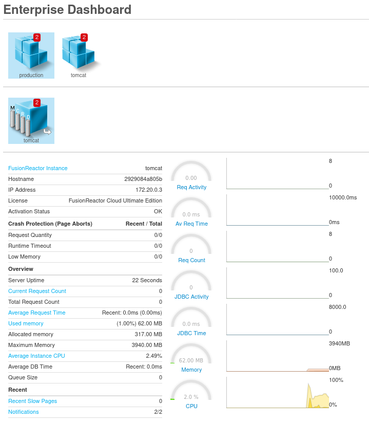

# Enterprise Dashboard.

FusionReactor support dynamically attaching instances to an instances Enterprise Dashboard.

For this example we run 1 FRAM and multiple tomcats which connect to the FRAM instance
and auto register themselves with its Enterprise Dashboard.

## Build

For this example 2 images need to be created.  One for the FRAM and one for the
Tomcat instances.

### Tomcat:

Inside the Tomcat directory run :

```bash
docker build -t edtomcat .
```

### FRAM

Inside the FRAM directory run :

```bash
docker build -t fram .
```

## Configure

You need to configure the ```.env``` file.

This contains your license key and password for the instances.

You should set the following properties
  * LICENSE
  * PASS

## Running

To run the test setup run :

```bash
docker-compose up
```

If you want to run more tomcat instances:

```
docker-compose up --scale tomcat=4
```

where tomcat= is the defines the number of instances you want.

## Viewing

Open the following link in your browser :

 * [Enterprise Dashboard](http://localhost:8187/fusionreactor/findex.htm?p=ed&__toc=enterprise)

You should see something like :


